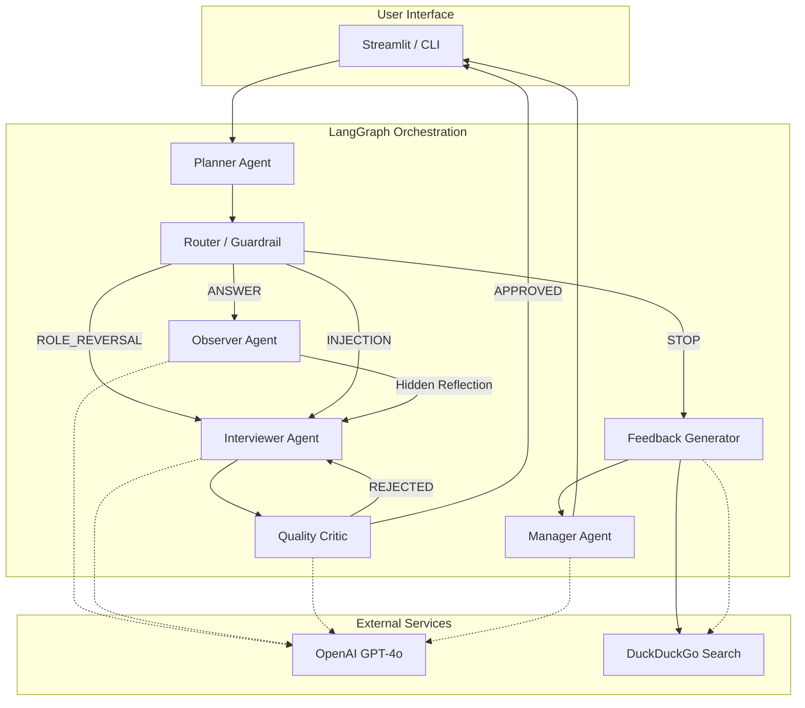

# Multi-Agent Interview Coach

[](https://github.com/Surmbruh/interview_agents/actions/workflows/ci.yml)
[](https://www.python.org/downloads/release/python-3110/)
[](https://langchain-ai.github.io/langgraph/)

**Multi-Agent Interview Coach** — система автоматизации технических интервью на базе LangGraph с многоагентной архитектурой. Проект демонстрирует принципы Agentic Workflow: ролевую специализацию, скрытую рефлексию, адаптивность и устойчивость к некорректным входным данным.

## Архитектура системы



## Ключевые свойства системы (Agentic Workflow)

| Свойство | Реализация |
|----------|------------|
| **Ролевая специализация** | 5 независимых агентов с разными промптами и задачами |
| **Скрытая рефлексия** | Observer анализирует ответы и передаёт инструкции Interviewer |
| **Сохранение контекста** | MemorySaver хранит историю, агенты учитывают предыдущие ответы |
| **Адаптивность** | Динамическое изменение сложности (INCREASE/DECREASE/MAINTAIN) |
| **Устойчивость к вбросам** | Router классифицирует: ANSWER, ROLE_REVERSAL, INJECTION, STOP |
| **Quality Loop** | Critic проверяет вопросы, отклоняет неподходящие (до 2 retry) |

## Структура проекта

```text
interview_coach/
├── .github/
│   └── workflows/
│       └── ci.yml              # GitHub Actions CI/CD pipeline
├── agents/                     # Логика специализированных агентов
│   ├── __init__.py
│   ├── critic.py               # Контроль качества вопросов
│   ├── interviewer.py          # Ведение диалога с кандидатом
│   ├── manager.py              # Финальное решение о найме
│   ├── observer.py             # Анализ ответов, скрытая рефлексия
│   └── planner.py              # Планирование тем интервью
├── tests/                      # Unit-тесты
│   ├── __init__.py
│   ├── test_router.py          # Тесты классификатора
│   ├── test_state.py           # Тесты Pydantic схем
│   └── test_log_format.py      # Тесты формата логов
├── utils/                      # Вспомогательные утилиты
│   ├── __init__.py
│   ├── llm_utils.py            # Retry-декораторы для LLM
│   ├── log_config.py           # Централизованное логирование
│   ├── logger.py               # Сохранение JSON-логов
│   └── report.py               # Генерация отчётов
├── config.py                   # Конфигурация (Pydantic Settings)
├── state.py                    # Схемы данных и AgentState
├── graph.py                    # LangGraph: узлы и переходы
├── router.py                   # Guardrail классификатор
├── feedback.py                 # Генерация финального фидбэка
├── main.py                     # CLI интерфейс
├── streamlit_app.py            # Веб-интерфейс
├── validate_logs.py            # Валидатор структуры логов
├── smoke_test.py               # Быстрая проверка импортов
├── Dockerfile                  # Контейнеризация
├── docker-compose.yml          # Оркестрация
├── Makefile                    # Автоматизация команд
└── requirements.txt            # Зависимости
```

## Быстрый старт

### 1. Клонирование и настройка

```bash
git clone https://github.com/Surmbruh/interview_agents.git
cd interview_agents

# Создание .env файла
cp .env.example .env
# Отредактируйте .env и добавьте OPENAI_API_KEY
```

### 2. Запуск через Docker (рекомендуется)

```bash
docker-compose up --build
```

Интерфейс доступен по адресу: `http://localhost:8501`

### 3. Локальный запуск

```bash
# Установка зависимостей
pip install -r requirements.txt

# Веб-интерфейс (Streamlit)
streamlit run streamlit_app.py

# CLI версия
python main.py
```

### 4. Запуск тестов

```bash
pip install pytest pytest-cov
pytest tests/ -v
```

## Алгоритм работы

```
1. START → Planner генерирует план из 4-5 тем
2. USER INPUT → Router классифицирует намерение
   ├── ANSWER → Observer анализирует → Interviewer отвечает
   ├── ROLE_REVERSAL → Interviewer отвечает на вопрос кандидата
   ├── INJECTION → Interviewer вежливо отказывает
   └── STOP → Feedback генерирует отчёт
3. Interviewer → Critic проверяет качество
   ├── APPROVED → Вывод пользователю
   └── REJECTED → Повторная генерация (макс 2 раза)
4. STOP → Manager принимает решение → Отчёт сохраняется
```

## Формат выходного лога

Каждая сессия сохраняется в `interview_log_{scenario_id}.json`:

```json
{
  "participant_name": "Иванов Иван",
  "turns": [
    {
      "turn_id": 1,
      "agent_visible_message": "Добрый день. Расскажите о своём опыте работы.",
      "user_message": "Я Junior Backend Developer с опытом 2 года...",
      "internal_thoughts": "[Observer]: Кандидат представился.\n[Interviewer]: Задам вопрос про Python.\n"
    }
  ],
  "final_feedback": "# Отчёт по интервью\n\n## Вердикт\n..."
}
```

## Структура финального отчёта

1. **Вердикт (Decision)**
   - Grade: Junior / Middle / Senior
   - Hiring Recommendation: Hire / No Hire / Strong Hire
   - Confidence Score: 0-100%

2. **Технический анализ (Technical Review)**
   - Confirmed Skills — темы с правильными ответами
   - Knowledge Gaps — ошибки с указанием правильных ответов

3. **Soft Skills & Communication**
   - Clarity, Honesty, Engagement

4. **Персональный Roadmap**
   - Рекомендации по обучению с ссылками на ресурсы (через DuckDuckGo Search)

## Конфигурация

Переменные окружения (`.env`):

```env
# Обязательно
OPENAI_API_KEY=sk-...

# Опционально (для прокси)
OPENAI_API_BASE=https://api.openai.com/v1

# Модели (по умолчанию)
MODEL_OBSERVER=openai/gpt-4o
MODEL_INTERVIEWER=openai/gpt-4o
MODEL_ROUTER=openai/gpt-4o-mini

# Уровень логирования
LOG_LEVEL=INFO
```

## Тестирование

```bash
# Все тесты
pytest tests/ -v

# С покрытием
pytest tests/ --cov=. --cov-report=html

# Только router тесты
pytest tests/test_router.py -v

# Валидация лога
python validate_logs.py interview_log_1.json
```

## Makefile команды

```bash
make run          # Запуск Streamlit
make cli          # Запуск CLI
make test         # Запуск тестов
make lint         # Проверка кода (ruff)
make docker-up    # Docker Compose up
make docker-down  # Docker Compose down
```

## Устойчивость к атакам

| Тип атаки | Обработка |
|-----------|-----------|
| **Промпт-инъекция** | Router → INJECTION → Вежливый отказ |
| **Смена роли** | Router → ROLE_REVERSAL → Ответ на вопрос + возврат к интервью |
| **Галлюцинации пользователя** | Observer детектирует ложные факты → Interviewer корректирует |
| **Off-topic** | Observer → возврат к теме интервью |

